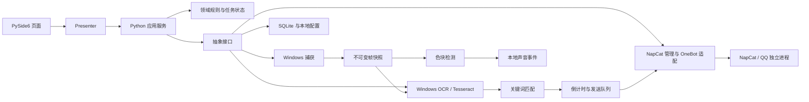

# 桌面端架构与文件结构规划

日期：2026-09-05  
关联需求：[PRD v1.1](./PRD.md)  
状态：目标架构；已建立分层桌面开发版，实际实现与未完成项见 [重构验收记录](./acceptance/2026-09-05-refactor.md)。下列目标结构不等同于全部已完成。

2026-09-05 功能修正：已加入 `application/monitor_tasks.py` 多任务协调器及 `infrastructure/napcat/shell.py` 本机启动/配置适配。各任务独立采集线程、OCR 工作进程、ROI 与触发状态，共用规则、QQ 连接和带任务标识的全局发送队列。预览完整来源，识别和发送使用裁剪快照。实现边界及验证见 [功能修正记录](./acceptance/2026-09-05-function-fixes.md)。

## 1. 技术决策

采用 Python + PySide6 Qt Widgets。UI、业务服务与平台适配分层，以接口和不可变数据对象连接。UI 不处理 OCR、NapCat 协议、SQL 或关键词匹配；领域规则不导入 Qt。

| 职责 | 拟选技术 | 边界 |
| --- | --- | --- |
| 原生界面 | PySide6 Qt Widgets、QSS、自定义绘制 | 不使用 HTML 页面或 WebView 作为主界面 |
| 业务逻辑 | Python，初始以 3.12 x64 验证 | 精确版本在 M0 与依赖共同冻结 |
| 数据 | sqlite3 + dataclasses，配置 JSON | SQL 只在存储适配器，JSON 原子替换 |
| 捕获 | Windows Graphics Capture Python 适配，显示器兼容适配 | 先验证 wheel/打包；必要时显示器回退 mss，不能声称回退支持被遮挡窗口 |
| OCR | Python WinRT + 本地 Tesseract 适配 | 输出统一 OcrResult，不依赖 legacy 脚本 |
| 图像处理 | NumPy/Pillow | 纯像素算法，与 Qt 预览解耦 |
| NapCat 登录 | Python HTTP 客户端 httpx | 管理接口私有兼容层，区别 OneBot |
| NapCat 发送 | Python websockets 正向 WS 客户端 | NapCat 为服务端，应用为客户端 |
| 异步调度 | 后台线程独立 asyncio loop；Qt queued signals | Qt 主循环不直接运行阻塞任务 |
| 声音 | Qt Multimedia | 由 GUI 线程的音频控制器响应业务事件 |
| 进程管理 | Python subprocess + Windows Job Object | 明确归属；控制台默认隐藏 |
| 打包 | PyInstaller onedir，后续封装安装器 | 在 Windows 构建，第三方运行时独立管理 |
| 开发检查 | pytest、pytest-qt、ruff | 核心行为、适配契约及少量关键 UI 流程 |

这里只列初选依赖，不代表已安装或验证。`pyproject.toml` 表达直接依赖和开发分组，锁文件由 M0 选定的管理工具生成并提交，避免同时维护多个互相漂移的锁源。

## 2. 分层与数据流



依赖方向：`ui → application → domain`；`infrastructure → application.ports / domain`。`bootstrap.py` 作为唯一组合根创建具体实现并注入。基础设施不反向依赖页面，领域层只使用标准库。业务模块不互相查找 QWidget，也不使用全局单例传递状态。

## 3. 目标仓库目录

```text
screen-qq-ocr/
├── README.md                         # 桌面版入口、开发和打包说明
├── pyproject.toml                    # 包名、依赖、入口、检查配置
├── uv.lock                           # 若 M0 确定使用 uv，则作为唯一锁文件
├── .gitignore                        # 排除 venv、构建输出、凭据、用户运行数据
├── docs/
│   ├── PRD.md                        # 产品范围、交互、状态与验收
│   ├── ARCHITECTURE.md               # 本文
│   ├── decisions/                    # 关键决策，按实施结果逐项增加
│   │   ├── 0001-napcat-runtime.md    # 冻结版本、启动方式、原生登录契约
│   │   └── 0002-capture-ocr.md       # 捕获、双 OCR 与打包验证
│   └── acceptance/                   # 真机、视觉、性能与回归记录
├── src/
│   └── screen_qq_ocr/
│       ├── __init__.py
│       ├── __main__.py                # python -m screen_qq_ocr
│       ├── bootstrap.py               # 装配、单实例、日志和退出顺序
│       ├── domain/
│       │   ├── models.py              # Rule、Target、FrameMeta、SendTask 等
│       │   ├── states.py              # 监控、登录、发送枚举与合法迁移
│       │   ├── matching.py            # 归一化、非重叠计数、内容选择
│       │   ├── send_policy.py         # 默认/覆盖解析、连续确认与每轮触发
│       │   ├── templates.py           # 白名单模板解析、纯文本渲染与预览
│       │   ├── cooldown.py            # 独立冷却与规则占用
│       │   ├── flash.py               # 主色、连续变化、报警冷却
│       │   └── errors.py              # 可识别错误码，面向领域的异常
│       ├── application/
│       │   ├── ports.py               # Capture/Ocr/Messaging/Store/Clock 协议
│       │   ├── events.py              # 服务到 UI 的数据事件
│       │   ├── monitoring.py          # 会话、配置快照、两条监控分支
│       │   ├── capture_service.py     # 采集与 ROI 生命周期
│       │   ├── ocr_service.py         # 单任务调度、单次识别、错误恢复
│       │   ├── rule_service.py        # CRUD、校验、导入事务与修订号
│       │   ├── sending.py             # 队列、倒计时、取消、限速、过期
│       │   ├── qq_service.py          # 启动/登录/连接/目标流程
│       │   ├── napcat_config_service.py # 草稿、校验、应用、回读与回滚
│       │   ├── send_config_service.py # 默认策略、覆盖、试算与测试发送
│       │   └── settings_service.py    # 配置加载、变更及生效范围
│       ├── infrastructure/
│       │   ├── capture/
│       │   │   ├── windows_capture.py # WGC 捕获源适配
│       │   │   ├── monitors.py        # 显示器/窗口枚举、有效性
│       │   │   └── coordinates.py     # DIP/物理像素、负坐标与 ROI
│       │   ├── ocr/
│       │   │   ├── windows_ocr.py     # WinRT 引擎
│       │   │   ├── tesseract.py       # 本地 Tesseract 引擎
│       │   │   └── preprocessing.py   # 灰度、反色、对比度与缩放
│       │   ├── napcat/
│       │   │   ├── runtime.py         # 部署导入、版本验证、启停
│       │   │   ├── management.py      # 管理鉴权、二维码、登录状态
│       │   │   ├── onebot.py          # WS 生命周期、echo 关联、请求超时
│       │   │   ├── messages.py        # 文本/图片消息段与回执映射
│       │   │   ├── config.py          # 实例配置读取、生成、差异、写入与备份
│       │   │   └── compatibility.py   # 受支持版本、路由/字段差异
│       │   ├── persistence/
│       │   │   ├── database.py        # 数据库连接、事务和迁移
│       │   │   ├── repositories.py    # 规则、目标、发送摘要读写
│       │   │   ├── migrations/       # 0001_initial.sql 等
│       │   │   └── keyword_files.py   # legacy TXT 与完整 JSON 编解码
│       │   ├── platform/
│       │   │   ├── paths.py           # 用户数据路径、只读资源定位
│       │   │   ├── credentials.py     # Windows 用户凭据
│       │   │   ├── processes.py       # 进程归属、隐藏窗口、Job Object
│       │   │   └── session.py         # 锁屏、休眠、单实例事件
│       │   └── logging.py             # 轮转、脱敏与结构化输出
│       ├── runtime/
│       │   ├── workers.py             # OCR/capture worker 生命周期
│       │   ├── async_loop.py          # 后台 asyncio 线程与任务提交
│       │   └── qt_bridge.py           # queued signal 桥接与事件节流
│       ├── ui/
│       │   ├── main_window.py         # 窗口、导航与状态区
│       │   ├── tray.py                # 托盘菜单和生命周期
│       │   ├── audio.py               # Qt 音频事件消费者
│       │   ├── pages/
│       │   │   ├── monitor_page.py
│       │   │   ├── keywords_page.py
│       │   │   ├── qq_page.py
│       │   │   ├── send_config_page.py # 条件/格式/对象页签与预览
│       │   │   ├── records_page.py
│       │   │   └── settings_page.py
│       │   ├── presenters/            # 对应页面的命令、视图状态绑定
│       │   ├── models/                # 规则/联系人/日志 QAbstractItemModel
│       │   ├── widgets/
│       │   │   ├── preview.py         # 预览、原生 ROI 操作
│       │   │   ├── rule_editor.py     # 编辑抽屉
│       │   │   ├── qr_panel.py        # 二维码与状态覆盖层
│       │   │   ├── napcat_config.py   # 连接表单与草稿/生效状态
│       │   │   ├── message_editor.py  # 固定文本、模板变量与格式预览
│       │   │   ├── target_picker.py   # 好友/群搜索、账号绑定与继承
│       │   │   ├── pending_send.py    # 倒计时与取消
│       │   │   └── controls.py        # 圆角按钮、卡片、状态标签
│       │   └── theme/
│       │       ├── tokens.py          # 颜色、字体、尺寸的唯一来源
│       │       ├── animations.py      # 时长/缓动统一工厂
│       │       ├── window_frame.py    # 原生圆角、缩放与命中测试
│       │       └── light.qss
│       └── resources/
│           ├── icons/                # SVG/ICO 源资源
│           ├── sounds/               # 提示音与来源声明
│           └── defaults.json         # 不含密钥的默认设置
├── tests/
│   ├── unit/                         # 匹配、冷却、闪烁、消息状态、TXT
│   ├── integration/                  # 数据库迁移、假 OneBot 与捕获取帧
│   ├── ui/                           # pytest-qt 核心操作与信号行为
│   ├── fixtures/                     # 合成帧、标注文本、脱敏协议响应
│   └── manual/                       # 真机 QQ、DPI、登录和长时脚本清单
├── scripts/
│   ├── dev.ps1                       # 仅开发启动，不承载业务逻辑
│   ├── build.ps1                     # Windows 构建入口
│   └── verify_runtime.py             # 校验发行清单和资源完整性
├── packaging/
│   ├── screen_qq_ocr.spec            # PyInstaller 资源/模块/引擎收集
│   ├── app.manifest                  # DPI awareness 与权限声明
│   ├── runtime-manifest.json         # 已验证版本、文件摘要及来源
│   └── THIRD_PARTY_NOTICES.md        # Qt、OCR、模型、NapCat 等组件声明
└── legacy/                           # 旧项目参考，禁止运行时依赖
```

不预创建所有空目录；按里程碑建立实际需要的文件。初期小模块可以合并，但 `domain/application/infrastructure/ui` 的依赖边界保持不变。`legacy/` 不加入新版本打包输入。

## 4. 运行目录与配置归属

```text
%LOCALAPPDATA%/ScreenQQOCR/
├── settings.json                     # schema_version、UI、采集/OCR/发送设置
├── app.db                            # 规则、目标绑定、发送结果摘要
├── backups/                          # 导入替换和数据库迁移前备份
├── logs/                             # 轮转脱敏日志
├── cache/                            # 必要临时文件，启动回收过期项
└── runtimes/
    ├── tesseract/<version>/           # 可选本地引擎及语言文件
    └── napcat/<version>/
        ├── ...                       # 官方运行文件，按包结构保留
        └── <instance-data>/           # 配置/会话位置由兼容适配器确定
```

`<instance-data>` 是逻辑角色，不假定 NapCat 支持任意工作目录参数；若固定包要求配置相对安装目录，则使用专属副本管理。用户已有运行时目录只在附加模式读取，不通过“自动修复”改写。

备份默认保留最近 5 份；缓存启动和退出清理、最长 24 小时。内存中的命中图片随任务释放，只有引擎/协议确需文件时落临时 PNG，等待请求结束后清理。数据库与配置导出默认排除登录凭据和会话。

配置唯一归属：规则、默认发送策略、规则覆盖、目标、发送结果摘要及 NapCat 配置修订记录在数据库；UI、采集/OCR/色块和通用参数在 settings.json；凭据在 Windows 凭据存储。NapCat 实际配置由适配器读取和应用，数据库记录草稿与最近验证生效的快照，不能把快照当作外部服务实时状态。不得把发送策略同时存进 JSON、QSettings 和 SQLite。JSON 使用临时文件、flush 和原子替换；SQLite 使用事务，写操作经单一工作器串行化。

## 5. 核心对象与接口

| 对象 | 必要字段 |
| --- | --- |
| KeywordRule | id、keyword、min_count、enabled、sort_order、send_overrides、revision；旧 custom_message 导入时转固定正文覆盖 |
| SendPolicy | 连续确认帧数、重复方式、冷却、倒计时、消息类型、正文来源/模板、账号绑定目标；逐字段继承 |
| NapCatConfigRevision | 实例 ID、草稿、最近已验证快照、修订号、生效状态、变更摘要、备份引用；凭据只存引用 |
| CaptureSpec | source_type、source_id、source_metadata、roi_normalized、physical_size |
| FrameSnapshot | frame_id、session_id、capture_time、monotonic_time、roi、原始像素 |
| OcrResult | frame_id、engine、text、lines、elapsed_ms、预处理变换信息 |
| QQTarget | account_id、type(private/group)、id、display_name、verified_at |
| SendTask | task_id、session_id、rule_id、revision、policy_snapshot、frame_id、target_snapshot、text、image_ref、state、expires_at、is_test |
| SendReceipt | task_id、part(text/image)、message_id、status、error_code、submitted_at、completed_at |

所有 QQ 标识在本应用中按字符串保存，调用接口时由适配器处理兼容格式。时间戳用于显示与持久化；冷却、倒计时、超时基于单调时钟，避免系统校时影响。

接口建议：

```python
class CapturePort(Protocol):
    def list_sources(self) -> list[CaptureSource]: ...
    def open(self, spec: CaptureSpec) -> None: ...
    def latest_frame(self) -> FrameSnapshot | None: ...
    def close(self) -> None: ...

class OcrPort(Protocol):
    def availability(self) -> EngineStatus: ...
    def recognize(self, frame: FrameSnapshot, options: OcrOptions) -> OcrResult: ...

class MessagingPort(Protocol):
    async def get_account(self) -> QQAccount: ...
    async def list_targets(self) -> list[QQTarget]: ...
    async def send_part(self, target: QQTarget, part: MessagePart) -> ApiReceipt: ...
```

上述是设计签名，不是现有代码。`send_part` 不承诺幂等；`task_id/echo` 用于本应用关联请求，不能把它们当作 QQ 服务端去重键。统一错误包含类型、可读信息、原始错误码及是否可能已提交。

## 6. 线程、调度与退出

GUI 主线程只进行控件更新、用户输入、动画和声音控制。采集工作器持有最新帧槽位，覆盖旧帧，不使用无界视频队列；OCR 工作器处理单帧；色块工作器按 250ms 读取新帧并记录真实时间。网络使用单独 asyncio 线程处理管理 HTTP、OneBot WS 与发送队列。

跨线程只传不可变数据、图片只读引用和 Qt queued signals。QPixmap 在主线程创建，NumPy 缓冲区在发布帧后不得复用修改。日志 UI 批量刷新上限 5 次/秒、最多 1000 行；预览按 PRD 上限刷新，后台停止绘制而保持采集。

停止时递增 session_id 或作废会话令牌；尚在运行的 OCR 可完成但结果被丢弃。不得强制终止执行中的 Python 线程。第三方引擎若可能永久阻塞，M0 决定将其隔离为可终止工作进程，并实现有限等待与资源释放。

退出允许工作器最多 5 秒完成本地收尾；网络回执最多额外等待 10 秒，若请求采用更长超时则到退出等待上限时取消等待并将不确定结果落为未知。之后只回收本应用所拥有的进程。托盘“停止监控”和退出共用业务取消入口，避免 UI 关闭而后台仍发送。

## 7. NapCat 适配边界

业务登录控制与消息收发是两套通道：

| 通道 | 作用 | 验证方式 |
| --- | --- | --- |
| 本地管理 HTTP | 管理认证、二维码、登录状态、必要配置 | 绑定 tag/commit 的契约样本与真机扫码 |
| OneBot 正向 WS | 账号查询、好友/群列表、消息与回执 | echo 关联、心跳、retcode、账号一致性 |
| 受管理进程 | 包导入、启动、停止、版本检查 | PID/路径/创建时间、Job Object、退出测试 |

NapCat 文档说明正向 WS 支持请求与事件，本项目选择它实现长连接消息通道；具体鉴权和网络配置在适配器内完成。[官方配置说明](https://napneko.github.io/config/basic)

业务层只依赖 `start_runtime/get_login_state/refresh_qr/connect/send_part` 等内部接口，不散布管理路由。配置模板为冻结版本生成，只监听回环地址，不照抄官方示例中的全网监听值。未知版本先进行能力探测，不能只看“进程正在运行”即展示就绪。

OneBot 请求维护有限 pending map，唯一 echo 关联回包；校验 status/retcode/data.message_id；超时清理 pending map。心跳用于发现连接失效，默认 30 秒期望心跳、60 秒无响应转离线；调整后失活阈值取心跳间隔两倍。连接错误即时处理；默认连接重试间隔 1/2/4/8/15 秒，可配置关闭重连或修改上限。请求超时等范围遵循 PRD F06.1；重连的是连接本身，不自动重试发送动作。

配置应用采用可补偿的多步骤流程：保存草稿 → 校验/检测差异 → 暂停通知 → 备份 → 写入 → 必要重启 → 回读/鉴权 → 标记生效。文件、凭据存储和运行时不能用一个 SQLite 事务提交；服务必须记录阶段，在失败或应用重启后恢复/回滚未完成操作。附加模式只允许本应用连接参数变更，不写外部实例配置。

发送策略由 Python 解析执行，不写入 NapCat 的 OneBot 配置。默认策略与规则覆盖在同一数据库事务中保存；应用前计算受影响规则并取消其未提交任务。预览、试算和真实发送共享纯渲染/判断函数；试算读取运行状态快照但不修改计数，测试任务与生产轮次隔离并共用发送限速器。

冷却默认仅进程内保存，停止/恢复监控不清空；应用重启清空但不自动开始监控。发送记录不能直接作为待发队列恢复，避免重启补发历史告警。

## 8. 存储与迁移草案

- `keyword_rules`：规则字段、创建/更新时间；对归一化关键词设置唯一约束，事务中同步校验。
- `qq_targets`：账号、目标类型与 ID 组成唯一键，保存最近名称与核对状态。
- `send_policies`：默认发送策略与修订号；规则覆盖随规则事务保存，未覆盖字段保留继承语义。固定文本、模板和正文来源使用单一配置对象，旧消息字段仅作为导入兼容字段。
- `napcat_config_revisions`：实例的草稿/已验证快照、应用阶段与回滚引用；不保存明文凭据。
- `send_records`：任务、规则、账号/目标摘要、文字/图片分项状态与 message_id、错误码、创建/完成时间；索引创建时间、状态。
- `schema_meta`：数据库版本。

设置文件包含 capture、ocr、flash、appearance、lifecycle 分组，各字段默认值对应 PRD；存储 `schema_version`。发送策略和 NapCat 配置修订统一由数据库管理。迁移按版本逐步执行，损坏文件保留副本并提示恢复默认；不直接覆盖唯一原件。

TXT/JSON 导入先解析为临时规则集合，完成校验和预览后一次事务写入。备份和导入过程中不修改 `legacy/keywords.txt`。测试夹具使用合成数据，真实 QQ 会话、Token、好友名单不得提交。

## 9. 验证与交付顺序

1. M0 先验证 NapCat 原生二维码链路、好友与群的文字/图片回执；同时验证 Windows 采集坐标和双 OCR 的实际依赖，提交决策记录。
2. 建立包入口、分层骨架与主题；只实现一个监控页和关键词页的完整垂直流程后，再补其余页面。
3. 领域单元测试覆盖次数阈值、归一化、跨行回退、独立冷却、0 冷却占用、色块 5 点/4 变化、断帧。
4. 假 OneBot 测试覆盖超时、迟到响应、重复回包、掉线、文字成功图片失败、停止与发送竞态；禁止 CI 对真实 QQ 发送。
5. SQLite 迁移与 TXT 测试覆盖 BOM、Unicode、多分隔符、重复、替换备份和事务失败。
6. UI 测试覆盖规则编辑、禁用原因、倒计时取消、托盘恢复；真机人工检查 DPI、圆角、居中、留白与动画，结果写入 `docs/acceptance/`。
7. 使用 Windows onedir 发行包验证 Qt 平台插件、Qt Multimedia、WinRT 模块、Tesseract 和模型资源；在没有开发环境的账号下运行。
8. 完成 PRD 全部 P0 验收后再建立正式发布包与使用说明。

新增必测场景对应 PRD A23–A32：配置写入/重启/验证各阶段失败及回滚；外部配置冲突；默认值与覆盖继承；连续帧和每轮仅发一次；模板非法变量与固定花括号；仅截图消息；不同规则目标隔离；试算无副作用；新版 JSON 策略快照导入与 TXT 有损提示。

## 10. 与 legacy 的对应关系

| legacy 文件/部分 | 新归属 |
| --- | --- |
| `public/index.html`、`style.css` | `ui/pages`、`ui/widgets`、`ui/theme` |
| `app.js` 截屏与裁剪 | `capture_service`、`infrastructure/capture`、`preview` |
| `app.js` OCR 与预处理 | `ocr_service`、`infrastructure/ocr` |
| `app.js` 匹配与报警 | `domain/matching`、`cooldown`、`flash` |
| `app.js` 倒计时、发送、日志 | `application/sending`、`ui/pending_send`、日志适配 |
| `server.js` API 与文件管理 | Python 应用服务及存储适配，不保留 HTTP 路由 |
| `ocr-win.ps1` | Python WinRT 适配 |
| `qq-send.ps1`、`qq-list.ps1`、`qq-common.ps1` | NapCat 管理/OneBot 适配，不迁移窗口粘贴逻辑 |
| `keywords.txt` | 显式兼容导入，正式规则存 SQLite |
| `start.bat` 与 `scripts/setup.ps1` | 桌面发行包与开发脚本，业务无需终端 |

NapCat Shell 的实际生命周期由 `infrastructure/napcat/shell.py` 管理。Windows 启动器先以挂起状态创建，加入设置了 `KILL_ON_JOB_CLOSE` 的 Job Object 后再恢复执行，子进程继承归属，启动器提前结束也不丢失进程树。显式停止和应用退出回收该 Job；启动与关闭通过锁串行化，关闭标记拒绝迟到的启动请求。附加到已有监听端口不取得进程所有权，不按进程名称结束 QQ。

“QQ 连接 → 运行与登录”提供停止本应用所启动 NapCat 的入口。退出流程在连接清理的 `finally` 中关闭 NapCat，GUI 主循环结束时再次执行幂等清理；关闭到托盘不触发回收。
